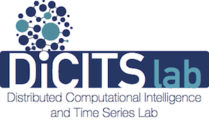
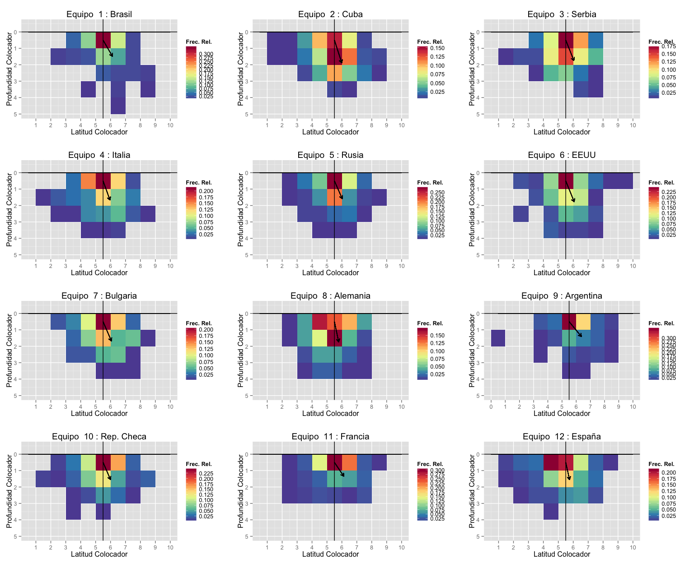
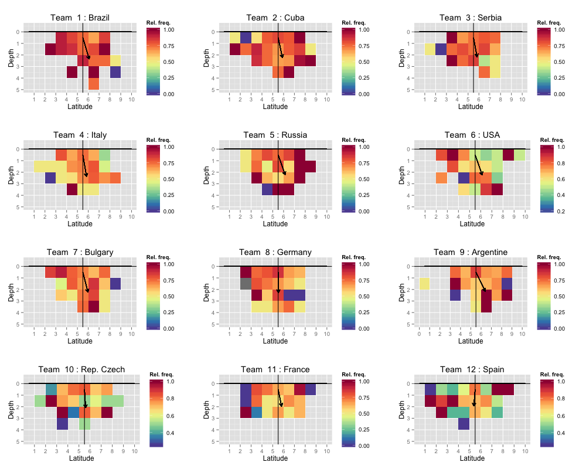
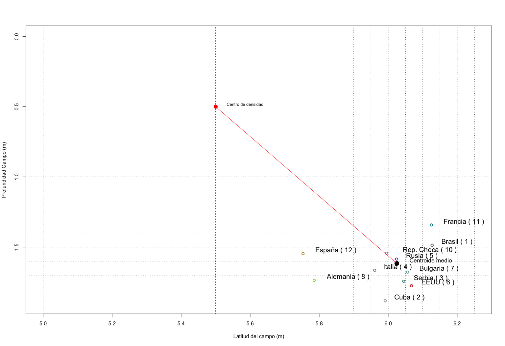

# VolleyBall Performance Analysis and Visualization using R

Created by

- Parra Royón, Manuel J. Department of Computer Science and Artificial Intelligence, University of Granada, Spain.
- Mercado-Palomino, Elia. Department of Physical Education and Sport, University of Granada, Spain.
- Morante Rábago, Juan Carlos. Faculty of Sport, University of León, Spain
- Benítez, José M. Department of Computer Science and Artificial Intelligence, University of Granada, Spain.
- Ureña Espa, Aurelio.  Department of Physical Education and Sport, University of Granada, Spain.

This work was supported by the Spanish Science and Innovation Ministry under Grants DEP2011-27503 and TIN2013-47210- P.

This study was approved by the Ethics Committee for Human Research at the University of Granada.

At:




The aim of the present study was to measure the middle hitter’s availability from the frequency distribution of the setter’s different positions, when the team maintained that availability.

**Key Words**: *centroid, match analysis, first tempo, middle hitter, performance indicator*.


## Installing the R package

```
# if you have not installed "devtools" package, install it.
install.packages("devtools")

library(devtools) 

install_github("manuparra/volleyball-performance-analysis", subdir="Rpackage")

```

## Using Methods


### Setter Performance visualization




### Attack Performance visualization




### Teams centroid, angles and distances





